TRADUCCIÓN Y ADAPTACIÓN DE UN CUESTIONARIO SOBRE ENTORNOS DE APRENDIZAJE
DE LAS MATEMÁTICAS EN EL HOGAR
================
Jesica Formoso, Sofía Ortiz, Florencia Prendivoj, Carla Errico

## Versión final del cuestionario

Si tienes a tu cuidado niños de entre 3 y 8 años y deseas colaborar
contestando la encuesta, puedes acceder a la misma utilizando este link
<a href="http://tiny.cc/AprendizajeEnHogar"
target="_blank">http://tiny.cc/AprendizajeEnHogar</a>

Si, por otro lado, te interesa utilizarla para un trabajo propio, puedes
descargar las preguntas completas en el siguiente link:
<a href="https://zenodo.org/record/7986289#.ZHYA8HZBzIU"
target="_blank">https://zenodo.org/record/7986289#.ZHYA8HZBzIU</a>

Para citar el cuestionario validado: *Formoso, J., Ortiz, S., Errico, C.
(2023). Traducción y adaptación de un cuestionario sobre entornos de
aprendizaje de las matemáticas en el hogar \[Poster\]. 3er Congreso
Nacional, 1er Congreso Internacional de Psicología de la Facultad de
Psicología, Universidad Nacional de San Luis, San Luis, Argentina. Doi:
10.5281/zenodo.7986364*

## Introducción

Los niños y niñas cuentan con habilidades matemáticas de aparición
temprana desde sus primeros años de vida, como la estimación y
discriminación de cantidades, el conteo y el reconocimiento de arábigos.
Estas se encuentran en la base de la adquisición de habilidades más
complejas, asociadas tradicionalmente a la educación formal (Kleemans,
Peeters, Segers, & Verhoeven, 2012; Purpura, Hume, Sims, & Lonigan,
2011). Sin embargo, diversos estudios sugieren que las experiencias
informales desarrolladas en el entorno familiar influyen sobre la
adquisición posterior de habilidades matemáticas y, por consiguiente,
sobre rendimiento académico (LeFevre et al., 2009; Segers, Kleemans, &
Verhoeven, 2015). La cantidad y calidad de tiempo de interacción entre
las personas cuidadoras y los/as niños/as, los recursos materiales
utilizados, las expectativas que madres y padres tienen sobre los logros
académicos de sus hijos e hijas, pueden influir sobre la generación de
aprendizajes significativos.

### Objetivo del presente trabajo

Debido a que estudios previos han detectado efectos del contexto
hogareño de aprendizaje sobre el desarrollo de las habilidades
matemáticas en niños resulta de interés contar con un instrumento
adaptado a la población local que permita objetivar la medición de esta
variable. Luego de una búsqueda bibliográfica extensa, seleccionamos un
cuestionario publicado en LeFevre et al. (2009). El mismo fue traducido
al español por tres profesionales independientes, luego se realizó una
puesta en común y síntesis, se retradujo al inglés y se evaluó la
concordancia entre la versión final y la original. Finalmente, se
realizó un estudio para evaluar su validez y fiabilidad. A continuación
se describe ese proceso.

## Descripción de los participantes

Los siguientes datos corresponden a un cuestionario completado por
madres, padres y personas cuidadoras de niños y niñas de entre 3 y 8
años de edad. Los datos fueron recabados entre el 01/02/2023 y
31/01/2023. Incluye respuestas de 225 participantes. De las personas
cuidadoras el 90.2% es de género femenino y 9.8% de género masculino,
con una edad promedio de 38.71 (DE = 6.16). Sus respuestas
correspondieron a 48 % de niñas y 52 % de niños, con una edad en meses
promedio de 71.28 (DE = 21.55). De los niños y niñas sobre los que se
respondió el cuestionario, 1.3% tenían alteraciones sensoriales
(daltonismo e hipoacusia) y 4.9% dificultades del aprendizaje o de
adquisición del lenguaje.

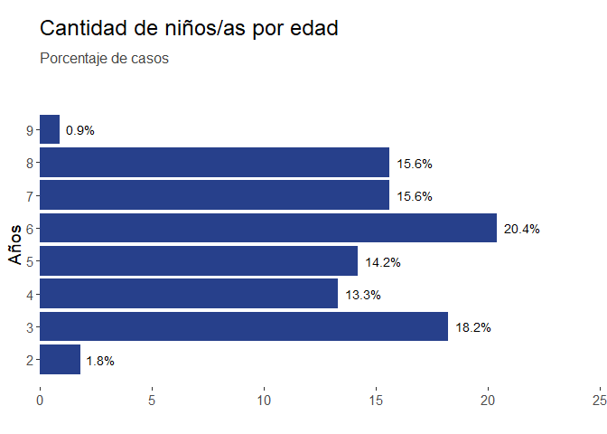

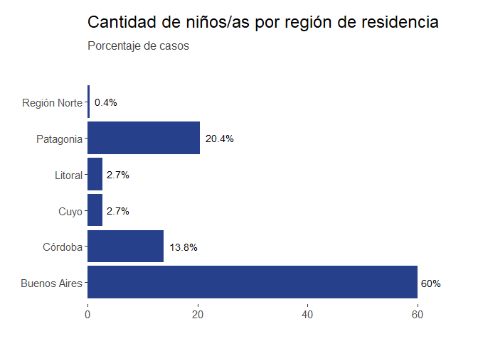

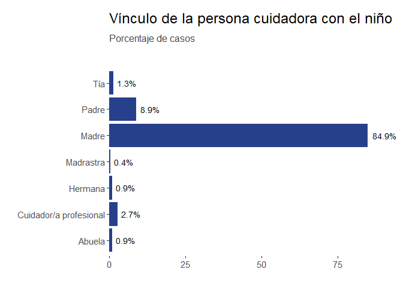

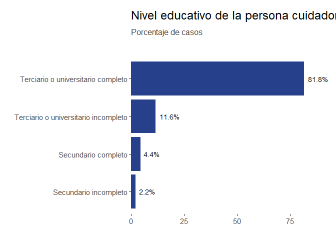

## Descripción de las respuestas a los ítems

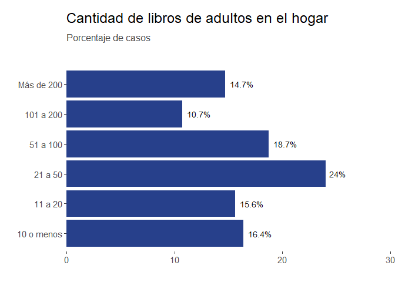

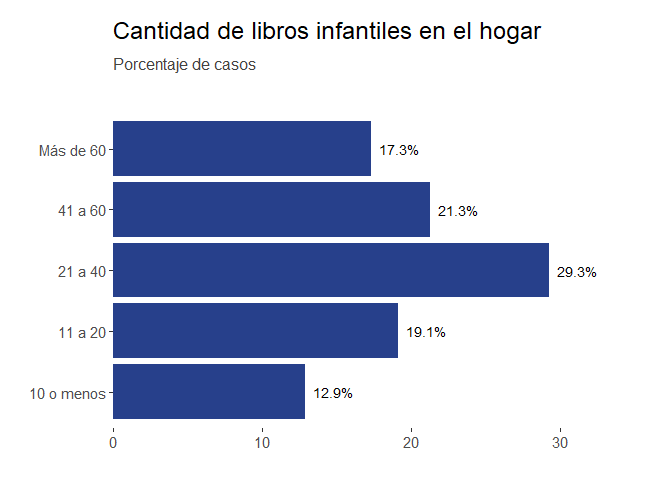

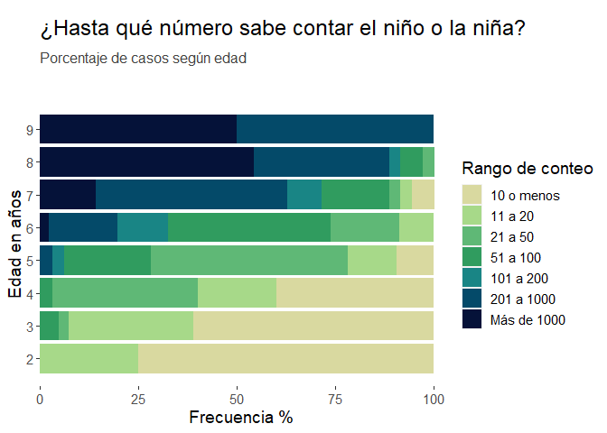

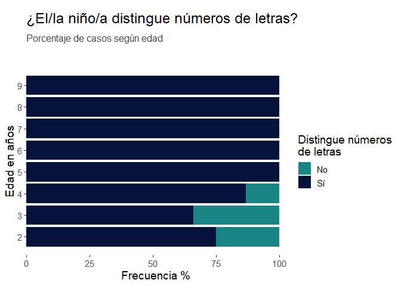

### En tu opinión, ¿qué tan importante considerás que es para un niño alcanzar los siguientes objetivos antes de ingresar al sala de 4 en el jardín?

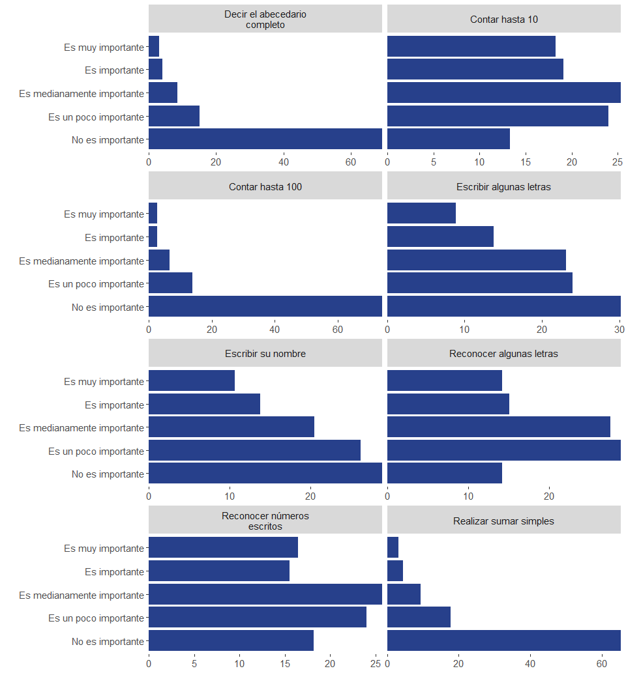

### En el mes pasado, ¿con qué frecuencia realizaron las siguientes actividades vos y el/la niño/a?

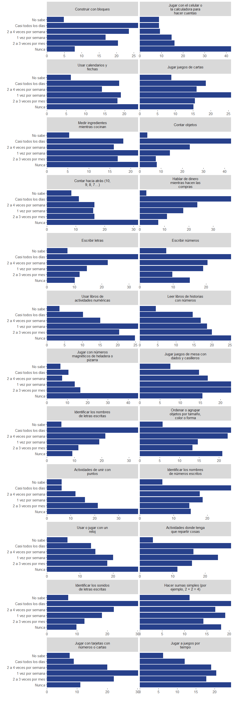

### Por favor, leé las siguientes afirmaciones e indicá el grado en que estás de acuerdo con cada afirmación marcando la opción correspondiente.

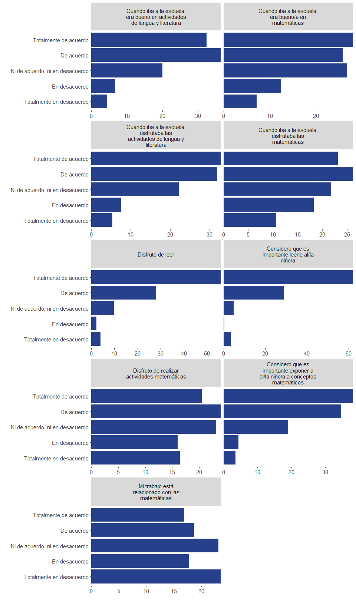

## Validez y fiabilidad

### Validez de contenido por juicio de expertos

Se constituyó un panel de 3 expertas en la temática con 25 años de
experiencia en promedio para evaluar la validez de contenido de la
versión descrita previamente, resultado de la traducción y adaptación de
los ítems. Para ello, cada una respondió un cuestionario en el que
debían puntuar la claridad, relevancia y coherencia de cada ítem y la
suficiencia del conjunto de ítems para describir el constructo
utilizando una escala Likert de 4 puntos (1. No cumple con el criterio,
2. Nivel bajo, 3. Nivel moderado, 4. Nivel alto). Se realizaron dos
iteraciones. En la primera, se evaluaron el nivel de acuerdo entre las
expertas utilizando el coeficiente AC1 de Gwet. Se modificaron aquellos
ítems con un nivel bajo de acuerdo (0.67 o menor) y/o con puntajes bajos
de coherencia, claridad o relevancia (puntaje 1 o 2). Se agregaron ítems
sugeridos por las expertas para alcanzar un nivel de suficiencia alta.
En la segunda iteración, la versión final del cuestionario obtuvo
niveles de acuerdo altos y puntajes moderados o altos para todas las
medidas de calidad. Se calculó un índice de validez de contenido de 1
(100%) (Yusoff, 2019a).

### Validez aparente

Para evaluar la validez aparente se administró la versión final a un
grupo de 10 personas cuidadoras de niños o niñas de entre 3 y 8 años que
asignaron puntajes de 1 o 0 a cada uno de los ítems para indicar si
estos resultaban claros y comprensibles. Se realizó una entrevista final
para evacuar posibles dudas. Se calculó un índice de validez aparente
total de 0.98 (Yusoff, 2019b), donde los índices asociados a los ítem se
encuentran entre 0.70 y 1.

### Validez de constructo con análisis factorial exploratorio

Inicialmente, se obtuvo la matríz de correlaciones entre los ítems de la
escala (coeficiente de Spearman).

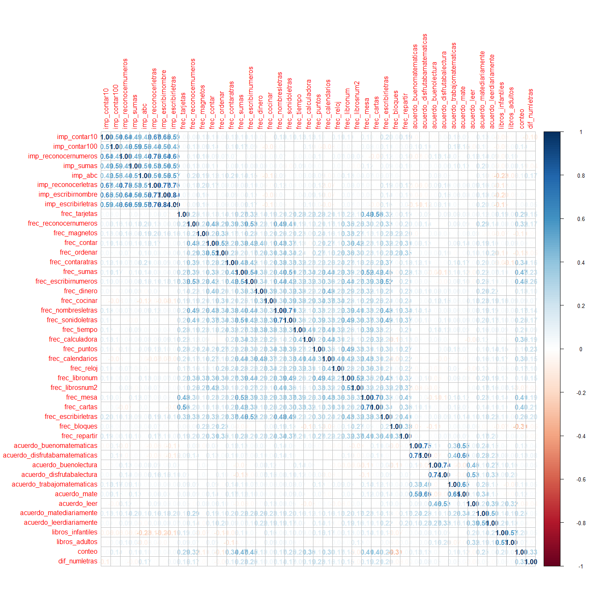

Para evaluar la adecuación de un análisis factorial, se calculó la
medida de adecuación muestral Kaiser-Mayer-Olkin (KMO) (kmo) y la prueba
de esfericidad de Bartlett $\chi^2_{990}$ = 5136.46, p \< .001. En ambos
casos los resultados sugieren que los datos son adecuados para realizar
un análisis factorial.

Luego, para identificar la cantidad de factores a extraer, se realizó un
análisis paralelo.

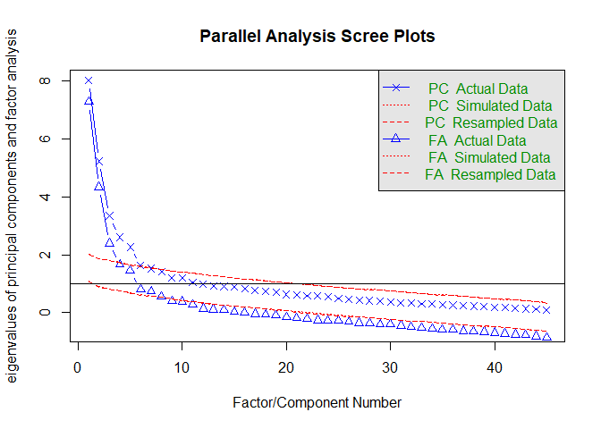

    Parallel analysis suggests that the number of factors =  7  and the number of components =  5 

Puede observarse que hay un punto de inflexión en los datos a partir de
4 o 5 componentes. El resultado de 4 factores mostró un mejor ajuste a
los datos por lo que retuvimos finalmente esta solución. Se utilizó como
método de rotación varimax, y mínimo residuo como método de estimación.
Se eliminaron aquellos ítems con cargas factoriales menores a 0.40 o que
carguen en más de un factor, estos son:

- Cantidad de libros de adultos disponibles en el hogar.
- Cantidad de libros infantiles disponibles en el hogar.
- Si el/la niño/a diferencia números de letras.
- Frecuencia con que la persona cuidadora y el/la niño/a juegan con
  bloques.
- Frecuencia con que la persona cuidadora y el/la niño/a juegan con
  números magnéticos.
- El nivel de acuerdo de la persona cuidadora con la necesidad de
  practicar matemáticas en el hogar cotidianamente.

A continuación se muestran las cargas factoriales para cada ítem y la
proporción de varianza explicada por cada factor en la versión final del
cuestionario.

    Loadings:
                                  MR1    MR2    MR3    MR4   
    imp_contar10                          0.717              
    imp_contar100                         0.708              
    imp_reconocernumeros                  0.771              
    imp_sumas                             0.725              
    imp_abc                               0.717              
    imp_reconocerletras                   0.845              
    imp_escribirnombre                    0.864              
    imp_escribirletras                    0.884              
    frec_tarjetas                  0.429                     
    frec_reconocernumeros          0.495                     
    frec_contar                    0.469                     
    frec_ordenar                   0.420                     
    frec_contaratras               0.488                     
    frec_sumas                     0.667                     
    frec_escribirnumeros           0.628                     
    frec_dinero                    0.490                     
    frec_cocinar                   0.497                     
    frec_nombresletras             0.615                     
    frec_sonidoletras              0.680                     
    frec_tiempo                    0.543                     
    frec_calculadora               0.420                     
    frec_puntos                    0.492                     
    frec_calendarios               0.609                     
    frec_reloj                     0.478                     
    frec_libronum                  0.635                     
    frec_librosnum2                0.517                     
    frec_mesa                      0.665                     
    frec_cartas                    0.563                     
    frec_escribirletras            0.584                     
    frec_repartir                  0.481                     
    acuerdo_buenomatematicas                     0.729       
    acuerdo_disfrutabamatematicas                0.842       
    acuerdo_buenolectura                                0.821
    acuerdo_disfrutabalectura                           0.823
    acuerdo_trabajomatematicas                   0.563       
    acuerdo_mate                                 0.815       
    acuerdo_leer                                        0.701
    acuerdo_leerdiariamente                             0.570

                     MR1   MR2   MR3   MR4
    SS loadings    6.620 5.050 2.478 2.349
    Proportion Var 0.174 0.133 0.065 0.062
    Cumulative Var 0.174 0.307 0.372 0.434

## Referencias

Kleemans, T., Peeters, M., Segers, E., & Verhoeven, L. (2012). Child and
home predictors of early numeracy skills in kindergarten. *Early
Childhood Research Quarterly*, *27*(3), 471–477.

LeFevre, J.-A., Skwarchuk, S.-L., Smith-Chant, B. L., Fast, L., Kamawar,
D., & Bisanz, J. (2009). Home numeracy experiences and children’s math
performance in the early school years. *Canadian Journal of Behavioural
Science/Revue Canadienne Des Sciences Du Comportement*, *41*(2), 55.

Purpura, D. J., Hume, L. E., Sims, D. M., & Lonigan, C. J. (2011). Early
literacy and early numeracy: The value of including early literacy
skills in the prediction of numeracy development. *Journal of
Experimental Child Psychology*, *110*(4), 647–658.

Segers, E., Kleemans, T., & Verhoeven, L. (2015). Role of parent
literacy and numeracy expectations and activities in predicting early
numeracy skills. *Mathematical Thinking and Learning*, *17*(2-3),
219–236.

Yusoff, M. S. B. (2019a). ABC of content validation and content validity
index calculation. *Education in Medicine Journal*, *11*(2), 49–54.

Yusoff, M. S. B. (2019b). ABC of response process validation and face
validity index calculation. *Education in Medicine Journal*,
*11*(10.21315).

